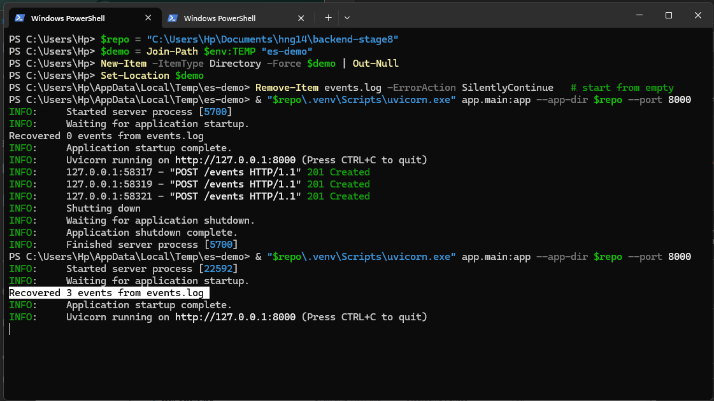

# Append-Only Event Store

A tiny write-ahead log: a key–value event store built on a single
append-only file (`events.log`) with an in-memory byte-offset index that
survives restarts. There is no database — **the log file is the database.**

Built with **Python 3.11 + FastAPI + uvicorn**, standard-library file I/O
only.

## Why this exists

When durability matters, the simplest correct design is often an append-only
log: you only ever add to the end of a file, never overwrite or delete. That
gives you a clear audit trail, cheap writes, and a recovery story that is easy
to reason about. This project is a minimal, honest implementation of that idea
— small enough to read in one sitting, but correct on the details that usually
break (unicode byte offsets, crash recovery, concurrent writes).

## Endpoints

| Method | Path           | Behaviour |
|--------|----------------|-----------|
| POST   | `/events`      | Accept any JSON body. Generate a UUID v4 `id`, stamp `createdAt` (ISO 8601 UTC), append one JSON line, update the index. Returns **201** with the full event. |
| GET    | `/events/{id}` | Look the id up in the index, seek to its byte offset, read exactly its byte length, parse, return **200**. Returns **404** if the id is unknown. |
| GET    | `/stats`       | Returns `{ "total": <#events>, "bytes": <file size> }`. |

## Setup

Requires Python 3.11+.

```bash
# with uv (recommended)
uv sync

# or with pip
pip install -e .
```

Run the server:

```bash
uvicorn app.main:app --port 8000
```

Run the tests:

```bash
uv run pytest -q      # or: pytest -q
```

## Usage (curl)

Create an event — any JSON body is accepted:

```bash
curl -i -X POST http://localhost:8000/events \
  -H "Content-Type: application/json" \
  -d '{"likerName": "Chidé 🎉"}'
```

```
HTTP/1.1 201 Created
content-type: application/json

{"likerName":"Chidé 🎉","id":"67be7f11-7b1b-4db0-9f49-a6fedd842e1e","createdAt":"2026-05-30T03:24:30.066416+00:00"}
```

Read it back by id:

```bash
curl -i http://localhost:8000/events/67be7f11-7b1b-4db0-9f49-a6fedd842e1e
```

```
HTTP/1.1 200 OK
{"likerName":"Chidé 🎉","id":"67be7f11-...","createdAt":"2026-05-30T03:24:30.066416+00:00"}
```

Unknown id returns 404:

```bash
curl -i http://localhost:8000/events/does-not-exist
```

```
HTTP/1.1 404 Not Found
{"detail":"Event not found"}
```

`/stats` reports the live event count and the on-disk byte size. After three
events have been stored (the unicode one above plus two more), it returns —
where `bytes` is the real UTF-8 size of the log on disk, not a character count:

```bash
curl -i http://localhost:8000/stats
```

```
HTTP/1.1 200 OK
{"total":3,"bytes":317}
```

## Architecture

```
                 POST /events                     GET /events/{id}
                      │                                  │
                      ▼                                  ▼
            ┌───────────────────┐              ┌───────────────────┐
            │  append() (locked)│              │       get()       │
            │  1. offset = size │              │  1. index[id]     │
            │  2. write bytes+\n│              │     -> (off, len)  │
            │  3. flush()       │              │  2. seek(off)     │
            │  4. index[id]=... │              │  3. read(len)     │
            └─────────┬─────────┘              └─────────┬─────────┘
                      │                                  │
                      ▼                                  │
            ┌───────────────────┐                        │
            │   events.log      │◄───────────────────────┘
            │ one JSON / line   │      direct byte-range read,
            │ strictly appended │      never a full-file scan
            └───────────────────┘
                      ▲
                      │  on startup: stream the whole file,
                      │  rebuild the index, log the count
            ┌───────────────────┐
            │  recover() -> int │  "Recovered N events from events.log"
            └───────────────────┘
```

- **`app/event_store.py`** — the `EventStore` class: `append`, `get`,
  `recover`, and the in-memory index.
- **`app/main.py`** — the FastAPI app, the three routes, and a `lifespan`
  hook that runs recovery before the server accepts requests.
- **`events.log`** — the only persistent store. Created on first write,
  gitignored (it is runtime data, not source).

### On-disk format

One JSON object per line, UTF-8, terminated by `\n`, strictly append-only.
The file is opened in append-binary (`"ab"`) for writes and binary (`"rb"`)
for reads — never in a truncating mode.

### The index

An in-memory `dict[str, tuple[int, int]]` mapping `id → (offset, length)`:

- `offset` = byte position of the first byte of the JSON object in the file.
- `length` = number of **bytes** of the JSON object, **excluding** the
  trailing `\n`.

Reads use the index plus a single `seek` + `read`. They never iterate the
file looking for a record.

## Core concepts

**Append-only is safer than overwriting.** An overwrite can leave a record
half-written and corrupt; an append either lands fully or doesn't. Old data is
never mutated, so a crash can only ever cost you the last in-flight write.

**Bytes, not characters.** The index stores byte offsets and byte lengths.
A JSON line containing `"Chidé 🎉"` has more *bytes* than *characters*, so the
length is computed on `json_str.encode("utf-8")`, never `len(json_str)`. If you
measure in characters, `seek()` lands mid-character and the read returns
garbage. There is a test that posts `{"likerName": "Chidé 🎉"}`, restarts, and
reads it back byte-for-byte specifically to guard this.

**The index lives in memory and is rebuilt at startup.** On boot, `recover()`
streams the log from the start, tracking a running byte offset: for each line it
records `{id: (offset, length)}` and advances the offset by the full line length
**including** the `\n`. It then logs exactly:

```
Recovered N events from events.log
```

A missing trailing newline on the final line is tolerated. So is a **torn final
record** — if a crash interrupted a write mid-line, recovery replays every
complete record, skips the incomplete tail, and warns on stderr, so the service
still starts. Corruption *earlier* in the file fails loud instead, because in an
append-only log only the tail can ever be partially written — a damaged interior
record means something is wrong that should not be silently swallowed.

**Durability is `flush()`, not `fsync()`.** After each append the file handle is
flushed, so a committed write survives a *process* crash. It does **not**
guarantee survival of an OS/power crash — that would require `fsync()`, which is
slower. For a prototype this trade-off is intentional and stated honestly rather
than hidden. A crash mid-write can still leave a half-written final line on disk;
recovery handles exactly that case by skipping the torn tail (see above), so a
restart after a crash is safe even though the last in-flight write may be lost.

**Writes are serialized.** Append, flush, and index update happen inside a
single `asyncio.Lock`, so two concurrent `POST`s can never interleave their
offset accounting and leave the file and index disagreeing.

## Recovery in action

Write a few events, stop the server, restart it, and the index is rebuilt from
the log — every id is still readable, including the unicode one.



```
write 3 events  →  stop server  →  restart server
                                       │
                                       ▼
                       Recovered 3 events from events.log
                                       │
                                       ▼
              GET /events/{id} for each → 200 with the original payload
```

## Project structure

```
app/
  __init__.py
  event_store.py     # EventStore: append, get, recover, index
  main.py            # FastAPI app + routes + lifespan recovery
tests/
  test_event_store.py
pyproject.toml
events.log           # runtime only, gitignored
```

## Tests

`pytest -q` covers: the 201 create path, append-only one-line-per-event,
correct byte offset/length in the index, direct seek/read on GET, 404 on
unknown id, atomic `/stats`, index rebuild on recovery, a missing-trailing-newline
log, a torn/corrupt trailing record that recovery skips while still recovering
every complete event, the exact recovery log line, and a full write → restart →
read round-trip with a unicode payload.

## Struggles

- **The unicode byte trap.** The first instinct is to use string length for the
  index. With ASCII it works and tests pass; the moment a payload has an emoji
  or an accented character, `seek` lands mid-character and reads break. Switching
  every offset/length calculation to UTF-8 bytes — and adding a unicode
  round-trip test — was the single most important correctness fix.
- **Offset accounting around the newline.** The offset must advance by the whole
  line including `\n`, but the stored `length` must exclude it, so that
  `read(length)` returns the JSON and not a stray newline. Getting these two
  rules consistent between the write path and the recovery path took care.
- **Startup wiring.** FastAPI's `@app.on_event("startup")` is deprecated, so
  recovery is wired through a `lifespan` context manager instead, which runs
  before the server serves any request.

## Lessons

- A correct append-only log is mostly about disciplined byte accounting and an
  honest durability story — not about clever code.
- Recovery is a first-class feature, not an afterthought: the index only exists
  in memory, so the ability to rebuild it deterministically from the log is what
  makes restarts safe.
- "It passes on ASCII" is not "it works." Edge-case tests (unicode, missing
  trailing newline) are where durability is actually proven.

## Resources

- [FastAPI documentation](https://fastapi.tiangolo.com/) — routing and the
  `lifespan` startup hook.
- [Python `io` / file objects](https://docs.python.org/3/library/io.html) —
  binary mode, `seek`, `read`, `flush`.
- [Uvicorn](https://www.uvicorn.org/) — the ASGI server.
- Write-ahead logging as a durability technique — the general idea behind
  "append to a log first, derive state from it."

## Why this improved my backend skill

This project forced me to understand durability at the byte level instead of
treating the database as a black box. I now reason concretely about append-only
writes, in-memory indexes over on-disk data, the difference between `flush` and
`fsync`, why offsets must be measured in bytes, and how to make a service
recover its state deterministically after a restart — the same primitives that
sit underneath real databases and write-ahead logs.
